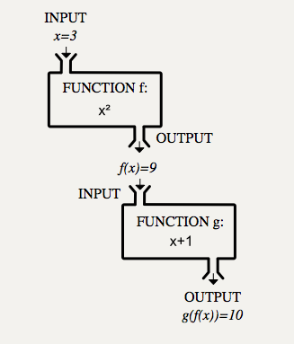
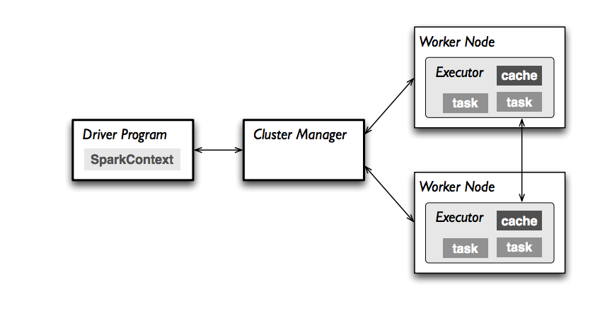
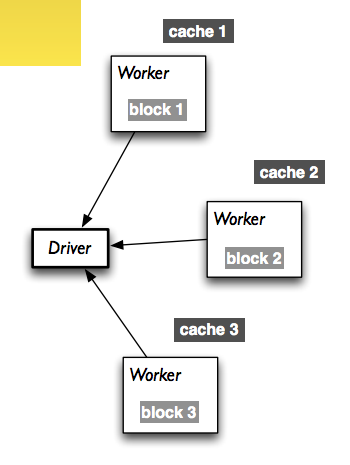
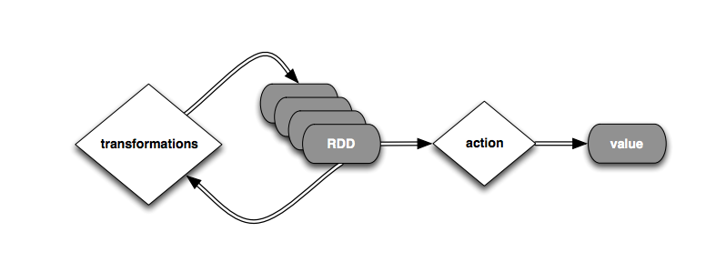

autoscale: true

# [fit] Parallelism and...


`rahuldave@gmail.com`     for    `harvard cs109`

---


from http://nbviewer.ipython.org/github/ogrisel/parallel_ml_tutorial/


---

# [fit]Embarrassingly Parallel

- Cross-Validation
- Grid Search
- Bagging

Other Ensembles such as Boosting need inter-process communication

---

## Single Machine:  `multiprocessing`

- master orchestrates the data split
- let c-val splits be read only, or maybe replicate
- create a pool of workers, and sub-pools for grid parameters
- each worker computes a validation score
- a "reducer" computes an average per sub-pool
- another "reducer" computes a minimum or maximum
- finally we output the model to the "master"


------

``` python
from multiprocessing import Pool
text = load (sys.argv[1])
# Build a pool of 8 processes
pool = Pool(processes=8,)

# Fragment the string data into 8 chunks
partitioned_text = list(chunks(text, len(text) / 8))

# Generate count tuples for title-cased tokens
single_count_tuples = pool.map(lambda L: [(w,1) for w in L], partitioned_text)

# Organize the count tuples; lists of tuples by token key [[],[],...] -> {token : [(token, 1), ...] .. }
token_to_tuples = shuffle(single_count_tuples)

# Collapse the lists of tuples into total term frequencies
term_frequencies = pool.map(lambda lot: (lot[0],sum(pair[1] for pair in lot[1]), token_to_tuples.items())

# Sort the term frequencies in nonincreasing order
term_frequencies.sort (tuple_sort)
```

from https://mikecvet.wordpress.com/2010/07/02/parallel-mapreduce-in-python/

------

##  Single machine

- use `multiprocessing`
- use `joblib`
  - wrapper, easy to use
  - adds caching and disk caching, useful for fails
  - used in `GridSearchCV`, `cross_val`, and `RandomForestClassifier` as `n_jobs` parameter

---

# [fit] BUT YOUR PROBLEM IS 

# [fit]YAY BIG

---

# Move it onto a cluster

## What if things fail?


So, use Map-Reduce: mrjob, Hadoop

# [fit] BUT

These write to disk and are slow and complex

---

## you can use

# [fit]`Ipython.parallel`

- Fast, easy to set up
- But the problem with failures has not gone away

## Ok for Graduate Student Descent, internal clusters.

---

You might have wondered: why the strange map-reduce paradigm

# [fit] Functional

- eliminate shared state in parallel programs
- data explicitly passed, no side effects
- thus functions connected via graph with data flows only
- guarantees on reconstruction on fail
- external scheduling

---

### We Want:

- Resilient
- Checkpointing
- Fast, does not always store to disk
- Replay-able
- Embarrassingly Parallel


---

Still a bit complex, but nicely layered to make it easier to use


---

# Setup



---


# Spark with Python


---

## [fit]Why better than hadoop?

- in memory as opposed to disk
  
- data can be cached in memory or disk for future use
  
- [fast](http://databricks.com/blog/2014/11/05/spark-officially-sets-a-new-record-in-large-scale-sorting.html) :
  
  > Using Spark on 206 EC2 machines, we sorted 100 TB of data on disk in 23 minutes. In comparison, the previous world record set by Hadoop MapReduce used 2100 machines and took 72 minutes. This means that Spark sorted the same data 3X faster using 10X fewer machines.
  
- RDDs
  
- Python, Java, and Scala interfaces
  
- Easier than Hadoop while being functional, runs a general DAG

---


## Key Concept:

# [fit]RDDs

## Resilient Distributed Datasets


---

### [fit]A *resilient distributed dataset* (RDD)

- is a fault-tolerant collection of elements (a listy thing) that can be operated on in parallel.


- Can be a list that is `parallelize`d or file or database storage.

> Unlike existing storage abstractions for clusters, which require data replication for fault tolerance, RDDs offer an API based on coarsegrained transformations that lets them recover data efficiently using lineage.

(http://www.cs.berkeley.edu/~matei/papers/2012/nsdi_spark.pdf)

---

 Spark works by running a *driver program* that runs the user’s `main` function and executes various *parallel operations* on RDDS on a cluster (or the local machine). 

Ops on RDDs : 

- *transformations* create a new dataset(RDD) from an existing one (`map`, `flatMap`)
- *actions* return a value to the driver (`collect`, `count`, `reduce`)
- *Shuffle* operations between these should be minimized

---

# [fit] WORD COUNT!

``` python
wordsList = ['cat', 'elephant', 'rat', 'rat', 'cat']
wordsRDD = sc.parallelize(wordsList, 3)
wordCountsCollected = (wordsRDD
                       .map(lambda w: (w, 1))
                       .reduceByKey(lambda x,y: x+y)
                       .collect())
```

`[('rat', 2), ('elephant', 1), ('cat', 2)]`

---

``` 
(4) PythonRDD[333] at RDD at PythonRDD.scala:43 []
 |  MapPartitionsRDD[332] at mapPartitions at PythonRDD.scala:346 []
 |  ShuffledRDD[331] at partitionBy at null:-1 []
 +-(4) PairwiseRDD[330] at reduceByKey at <ipython-input-138-c1214cba7909>:3 []
    |  PythonRDD[329] at reduceByKey at <ipython-input-138-c1214cba7909>:3 []
    |  ParallelCollectionRDD[308] at parallelize at PythonRDD.scala:396 []
```



---




``` python
text_file = spark.textFile("hdfs://...")
counts = (text_file.flatMap(lambda line: line.split(" "))
       .map(lambda word: (word, 1))
       .reduceByKey(lambda a, b: a + b)
)
counts.saveAsTextFile("hdfs://...")
```

## [fit]`FILE RDD —flatMap—>[list of words]—map—>[(word,1),..]—reduceByKey (map combiner + reduce transformation) —>[(word, count),..] --save Action-->File`

------

# [fit] Broadcasters and Accumulators

**Broadcaster**: read only-cached on each machine, spread data

``` python
broadcastVar = sc.broadcast(list(range(1, 4)))
```

**Accumulator**: only seen on driver

``` python
accum = sc.accumulator(0)
rdd = sc.parallelize([1, 2, 3, 4])
def f(x):
 global accum
 accum += x
rdd.foreach(f)
accum.value
```


---

# [fit] WAIT, THERE's MORE

- Dataframes, reading from databases
- Reading RDDs as SQL
- Streaming and online algorithms
- Machine learning (MLLIB)
- Machine learning pipelines
- Graph ops (GraphX)
- co-exists with other cluster apps through MESOS and YARN

---

# [fit] Credits and Reading

- Databricks and Berkeley Spark MOOC: https://www.edx.org/course/introduction-big-data-apache-spark-uc-berkeleyx-cs100-1x (the animals examples are stolen right from there).
- http://spark.apache.org/examples.html
- https://www.mapr.com/blog/5-minute-guide-understanding-significance-apache-spark
- http://spark.apache.org/docs/latest/programming-guide.html (many quotes taken from here)
- http://training.databricks.com/workshop/itas_workshop.pdf (a lot of figures are stolen from here)
- http://www.slideshare.net/pacoid/crash-introduction-to-apache-spark
- http://nbviewer.ipython.org/github/tdhopper/rta-pyspark-presentation/blob/master/slides.ipynb (some code examples taken from here)
- https://speakerd.s3.amazonaws.com/presentations/7ee131d78a2b43338de693076ed4ecc1/PySparkBestPractices.pdf

---