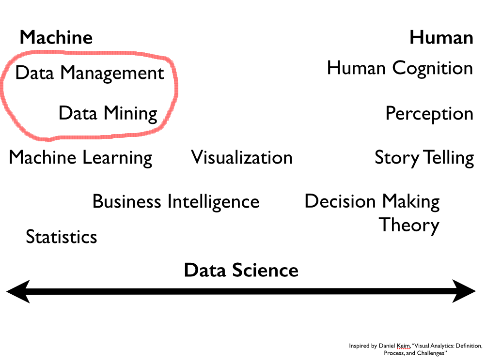
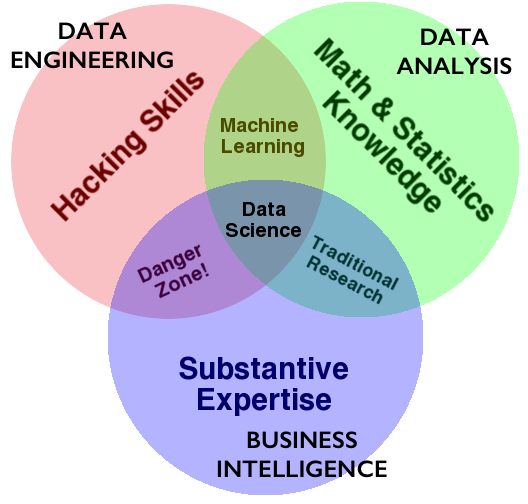
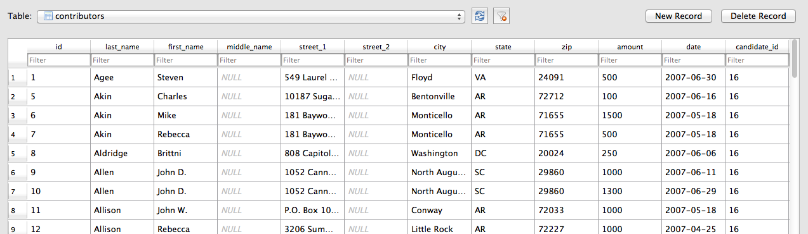
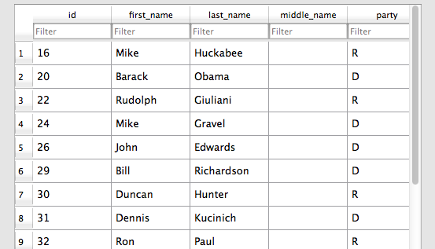
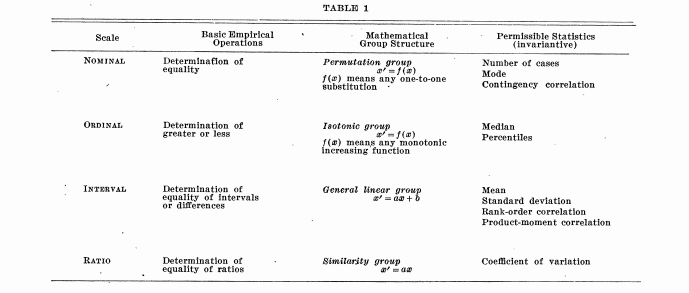
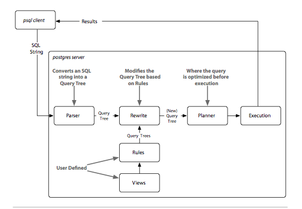

autoscale:true

#[fit] Databases, SQL, and Pandas

#cs109, Fall 2015 (#cs109)

# Rahul Dave

`rahuldave@gmail.com`, @rahuldave, `staff@cs109.org`

#ANNOUNCEMENTS

Class in in Science Center B starting THIS thursday, 17th Sep, 2015!

---

>It took about three years before the BellKor’s Pragmatic Chaos team managed to win the prize ... The winning algorithm was ... so complex that it was never implemented by Netflix. [^1]

[^1]:https://hbr.org/2012/10/big-data-hype-and-reality

---

---

---
#[fit]Data Scientist: Sexiest Job of the 21st Century

>It’s important that our data team wasn’t comprised solely of mathematicians
>and other “data people.” It’s a fully integrated product group that includes
>people working in design, web development, engineering, product marketing,
>and operations. They all understand and work with data, and I consider them
>all data scientists... Often, an engineer can have the insight that makes it >clear how the product’s design should work, or vice-versa — a designer can have
>the insight that helps the engineers understand how to better use the data. Or
>it may take someone from marketing to understand what a customer really
>wants to accomplish.[^2]

[^2]: D. J. Patil, U.S. Chief Data Scientist, Building data science teams. " O'Reilly Media, Inc.", 2011.

---

#[fit] DATA ENGINEERING

- **compute**: code, python, R, julia, spark, hadoop
- **storage/database**: git, SQL, NoSQL, HBase, disk, memory
- **devops**: AWS, docker, mesos, repeatability
- **product**: database, web, API, viz, UI, story

## Different at different scales....

---

#What kind of data storage do you need?

- **memory**
- **disk**: what if we do not fit?
- **cluster**: what if we still do not fit?
- **cluster**: what if we need/can use parts?
- What if we MUST bring compute to disk?

---

#What kind of data access do you need?

- **relational**: pandas, SQL: Postgres, sqlite, Hbase, VoltDB
- **document oriented**: MongoDB, CouchDB
- **key-value**: Riak, Redis, Memcached
- **graph oriented**: Neo4J

---

#Today we'll focus on relational

- What is a relational Database?
- What Grammar of Data does it follow?
- How is this grammar implemented in Pandas?
- How is this grammar implemented in SQL

---

#[fit]Relational Database

##_Dont say_: seek 20 bytes onto disk and pick up from there. The next row is 50 bytes hence

##_Say_: select data from a set. I dont care where it is, just get the row to me.

---

#[fit]Relational Database(contd)

- A collection of tables related to each other through common data values.
- Rows represent attributes of something
- Everything in a column is values of _one_ attributes
- A cell is expected to be atomic
- Tables are related to each other if they have columns called keys which represent the same values

---

##Contributors

 Candidates

---

#[fit]Scales of Measurement

- Quantitative (Interval and Ratio)
- Ordinal
- Nominal[^3]

[^3]: S. S. Stevens, Science, New Series, Vol. 103, No. 2684 (Jun. 7, 1946), pp. 677-680

---
#[fit]Grammar of Data

Been there for a while (SQL, Pandas), formalized in `dplyr`[^4].

- provide simple verbs for simple things. These are functions corresponding to  common data manipulation tasks
- second idea is that backend does not matter. Here we constrain ourselves to Pandas and sqlite
- multiple backends implemented in Pandas, Spark, Impala, Pig, dplyr, ibis, blaze

[^4]: Hadley Wickham: https://cran.rstudio.com/web/packages/dplyr/vignettes/introduction.html

---
#Why bother

- learn hot to do core data manipulations, no matter what the system
- relational databases critical for mon-memory fits. Big installed base.
- one off questions: google, stack-overflow, http://chrisalbon.com

---

#[fit]GO TO NOTEBOOK[^5]

[^5]: Diagram from 7 databases in 7 weeks, Pragmatic Programmers

---

#RDBMS when:

- data structure regularity is known
- transactions are required
- benefit from years of tuning
- not good for deep hierarchy
- which kind depends on use case: pandas, hbase, columnar, postgres,...

---

#[fit]FIN
