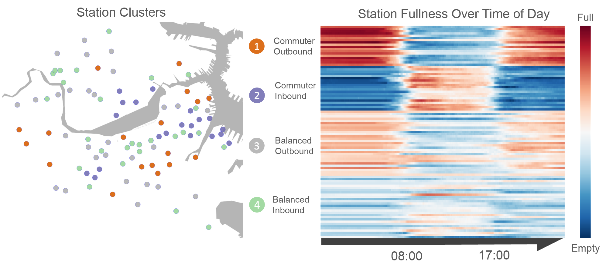

# CS109 Data Science

[Predicting Hubway Stations Status by
Lauren Alexander, Gabriel Goulet-Langlois, Joshua Wolff](http://cs109hubway.github.io/classp/)

Learning from data in order to gain useful predictions and insights. This course introduces methods for five key facets of an investigation: data wrangling, cleaning, and sampling to get a suitable data set; data management to be able to access big data quickly and reliably; exploratory data analysis to generate hypotheses and intuition; prediction based on statistical methods such as regression and classification; and communication of results through visualization, stories, and interpretable summaries.

We will be using Python for all programming assignments and projects. All [lectures will be posted here](http://cs109.github.io/2015/pages/videos.html) and should be available 24 hours after meeting time.

The course is also listed as AC209, STAT121, and E-109.

#### Lectures and Sections

* Lectures are 2:30-4pm on Tuesdays & Thursdays in Science Center B
* First week collective section Friday 9/4/ 10am-12pm in MD G115
* Section times on schedule page

#### Instructors

* Joe Blitzstein, Statistics, Office hours: Wednesdays 4-5pm in SC 714
* Hanspeter Pfister, Computer Science
* Verena Kaynig-Fittkau, Computer Science, Office hours: Tuesdays 4:15-5pm in NW B164

#### Staff

* Rahul Dave, Head TF
* And many others to come

Contact the staff at <a href="mailto:staff@cs109.org">staff at cs109 dot org</a>.

#### Material from CS 109 taught in Fall 2014

* Please find all material linked on this [webpage](http://cs109.github.io/2014/index.html).

#### Material from CS 109 taught in Fall 2013

* [Homework, labs and solutions](https://github.com/cs109/content)
