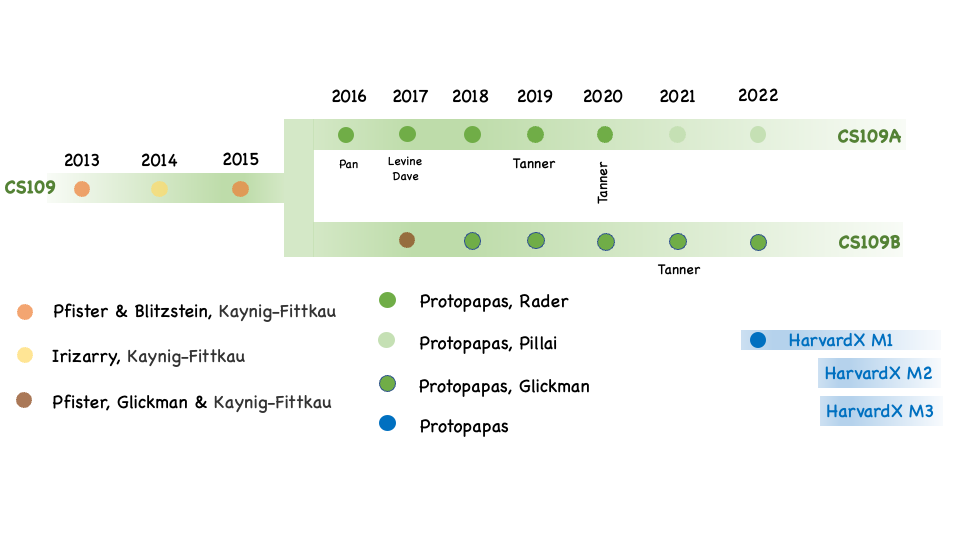

# CS109: Harvard's Data Science

 Harvard's CS109A course is an introductory course in data science, designed for students with some prior programming experience. The course covers a broad range of topics in data science, including data cleaning, visualization, analysis, and machine learning. Students learn to use tools such as Python to work with data and build statistical models. The course also includes a significant group project component, where students work in teams to apply their skills to a real-world data science problem. Overall, the course aims to provide students with a solid foundation in data science and prepare them for further study in the field  CS109B is a more advanced course in data science at Harvard, focused on topics in deep learning and probabilistic machine learning. The course  covers techniques for building and training deep neural networks, such as convolutional neural networks (CNNs) and recurrent neural networks (RNNs), as well as more recent developments in the field such as transformers and language models like BERT and GPT, GANs, Style Gans. Additionally, the course  explores unsupervised learning techniques, such as clustering, and covers probabilistic machine learning in a Bayesian framework. Overall, the course is  designed to provide students with a deep understanding of advanced techniques in data science and prepare them for research or careers in the field.
  
CS109 course at Harvard was originally taught as a one-semester course by Hanspeter Pfister and Joe Blister. The course has since expanded to two semesters, CS109A and CS109B, and has been taught by Pavlos Protopapas from SEAS and Natesh Pillai, Kevin Rader and Mark Glickman.  

  

<map name="image_map">
  <area alt="2014" title="2014" href="pages/2014" coords="34,139,141,292" shape="rect">
  <area alt="2015" title="2015" href="pages/2015" coords="175,135,266,188" shape="rect">
  <area alt="" title="" href="" coords="316,141,407,192" shape="rect">
  <area alt="" title="" href="" coords="587,27,696,87" shape="rect">
</map>

