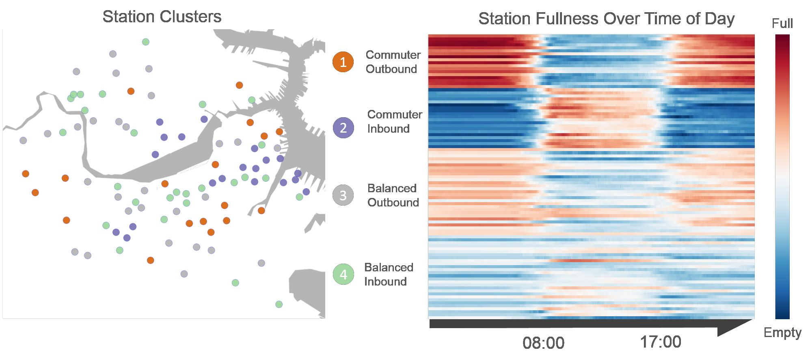

  <b> 2015 CS109A: Harvard's Data Science </b>
  

Learning from data in order to gain useful predictions and insights. This second iteration of the course continues to use methods for five key facets of an investigation: data wrangling, cleaning, and sampling to get a suitable data set; data management to be able to access big data quickly and reliably; exploratory data analysis to generate hypotheses and intuition; prediction based on statistical methods such as regression and classification; and communication of results through visualization, stories, and interpretable summaries.
     
  Python was used for all programming assignments and projects.  All <a href="http://cs109.github.io/2015/pages/videos.html"> lectures are be posted here</a>.
    
  <b>Instructors</b>

 <ul  style="font-family:Karla; font-size:1.3rem; color:#707070;line-height:1.6;"> 
<li  style="font-family:Karla; font-size:1.3rem; color:#707070;line-height:1.6;"> 
    Joe Blitzstein, Statistics</li>
<li  style="font-family:Karla; font-size:1.3rem; color:#707070;line-height:1.6;"> Hanspeter Pfister, Computer Science</li>
<li  style="font-family:Karla; font-size:1.3rem; color:#707070;line-height:1.6;"> Verena Kaynig-Fittkau, Computer Science</li>
  </ul>
  <b>Staff</b>
  <ul>
<li  style="font-family:Karla; font-size:1.3rem; color:#707070;line-height:1.6;">  Rahul Dave, Head TF</li>
  </ul>

