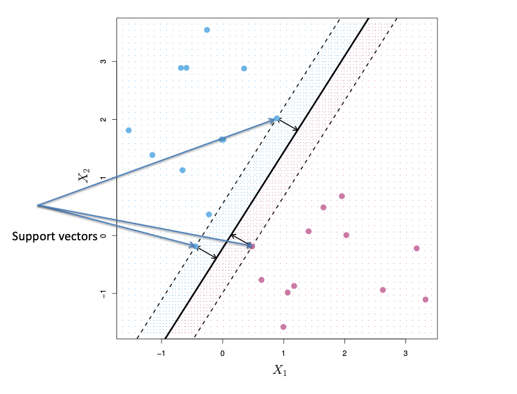

  <b> 2016 CS109A: Introduction to Data Science </b> 

 

 

 

 
Hal Varian Explains:
"The ability to take data – to be able to understand it, to process it, to extract value from it, to visualize it, to communicate it's going to be a hugely important skill in the next decades, not only at the professional level but even at the educaMonal level for elementary school kids, for high school kids, for college kids. Because now we really do have essenMally free and ubiquitous data.”
   
CS109A was the first half of a one‐year data science course. The course focused on the analysis of messy, real life data to perform predictions using statistical and machine learning methods. Material covered integratde the five key facets of an investigation using data: (1) data collection ‐ data wrangling, cleaning, and sampling to get a suitable data set; (2) data management ‐ accessing data quickly and reliably; (3) exploratory data analysis – generating hypotheses and building intuition; (4) prediction or statistical learning; and (5) communication – summarizing results through visualization, stories, and interpretable summaries.

  <b>Instructors</b>   
   <ul  style="font-family:Karla; font-size:1.3rem; color:#707070;line-height:1.6;"> 
<li  style="font-family:Karla; font-size:1.3rem; color:#707070;line-height:1.6;"> 
    Pavlos Protopapas, SEAS</li>
<li  style="font-family:Karla; font-size:1.3rem; color:#707070;line-height:1.6;"> Kevin Rader, Statistics</li>
<li  style="font-family:Karla; font-size:1.3rem; color:#707070;line-height:1.6;"> Weiwei Pan, SEAS</li>
</ul>

 

