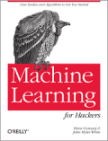

### WEEKLY RESOURCES

#### Week 3

- [Pandas Snippets](http://chrisalbon.com) by Chris Albon
- [Statistics for Hackers](https://speakerdeck.com/jakevdp/statistics-for-hackers) by Jake Vanderplas

#### Week 4

- [Duke Scientific Writing Resource](https://cgi.duke.edu/web/sciwriting/)
  
  ​

### Books

You can read O’Reilly books for free with a Harvard login at [this web site](http://proquest.safaribooksonline.com.ezp-prod1.hul.harvard.edu/).

[Python for Data Analysis, O’Reilly Media](http://shop.oreilly.com/product/0636920023784.do) - "Python for Data Analysis is concerned with the nuts and bolts of manipulating, processing, cleaning, and crunching data in Python. It is also a practical, modern introduction to scientific computing in Python, tailored for data-intensive applications. This is a book about the parts of the Python language and libraries you’ll need to effectively solve a broad set of data analysis problems. This book is not an exposition on analytical methods using Python as the implementation language.”

[Machine Learning for Hackers, O’Reilly Media](http://shop.oreilly.com/product/0636920018483.do) - "If you’re an experienced programmer interested in crunching data, this book will get you started with machine learning—a toolkit of algorithms that enables computers to train themselves to automate useful tasks. Authors Drew Conway and John Myles White help you understand machine learning and statistics tools through a series of hands-on case studies, instead of a traditional math-heavy presentation.”

A translation of the R examples in *Machine Learning for Hackers* to Python can be found here: [http://slendrmeans.wordpress.com/will-it-python/](http://slendrmeans.wordpress.com/will-it-python/)

 [Data Science For Business](http://shop.oreilly.com/product/0636920028918.do) 

Written by renowned data science experts Foster Provost and Tom Fawcett, Data Science for Business introduces the fundamental principles of data science, and walks you through the "data-analytic thinking" necessary for extracting useful knowledge and business value from the data you collect. This guide also helps you understand the many data-mining techniques in use today.

Based on an MBA course Provost has taught at New York University over the past ten years,*Data Science for Business* provides examples of real-world business problems to illustrate these principles. You’ll not only learn how to improve communication between business stakeholders and data scientists, but also how participate intelligently in your company’s data science projects. You’ll also discover how to think data-analytically, and fully appreciate how data science methods can support business decision-making.

[Probabilistic Programming and Bayesian Methods for Hackers](http://nbviewer.ipython.org/urls/raw.github.com/CamDavidsonPilon/Probabilistic-Programming-and-Bayesian-Methods-for-Hackers/master/Prologue/Prologue.ipynb) - "The Bayesian method is the natural approach to inference, yet it is hidden from readers behind chapters of slow, mathematical analysis. The typical text on Bayesian inference involves two to three chapters on probability theory, then enters what Bayesian inference is. Unfortunately, due to mathematical intractability of most Bayesian models, the reader is only shown simple, artificial examples. This can leave the user with a so-what feeling about Bayesian inference. In fact, this was the author's own prior opinion.”

### Basic Data Science Motivation and Introduction

[1] [BBC Documentary: The Age of Big Data (58 mins)](https://www.youtube.com/watch?v=dzlwhP5JejA)

[2] [Data Science Workflow: Overview and Challenges](http://cacm.acm.org/blogs/blog-cacm/169199-data-science-workflow-overview-and-challenges/fulltext) by Philip Guo

[3] [Enterprise Data Analysis and Visualization: An Interview Study](http://vis.stanford.edu/files/2012-EnterpriseAnalysisInterviews-VAST.pdf), Sean Kandel, Andreas Paepcke, Joseph Hellerstein, Jeffrey Heer, IEEE Visual Analytics Science & Technology (VAST), 2012

[4] [That's Funny…](http://www.americanscientist.org/issues/pub/thats-funny), Howard Wainer and Shaun Lysen, American Scientist, 2009

### Visualization

[1] [matplotlib - 2D and 3D plotting in Python](http://nbviewer.ipython.org/urls/raw.github.com/jrjohansson/scientific-python-lectures/master/Lecture-4-Matplotlib.ipynb), J.R. Johannson, .ipynb

[2] [A Gallery of Statistical Graphs in Matplotlib (Matplotlib Defaults)](http://nbviewer.ipython.org/urls/raw.github.com/cs109/content/master/lec_03_statistical_graphs_mpl_default.ipynb), C. Beaumont, .ipynb

[3] [A Gallery of Statistical Graphs in Matplotlib](http://nbviewer.ipython.org/urls/raw.github.com/cs109/content/master/lec_03_statistical_graphs.ipynb), C. Beaumont, .ipynb

[4] [Wrangler: Interactive Visual Specification of Data Transformation Scripts](http://vis.stanford.edu/papers/wrangler), Sean Kandel, Andreas Paepcke, Joseph Hellerstein, Jeffrey Heer, ACM Human Factors in Computing Systems (CHI), 2011 [[Data Wrangler tool web site](http://vis.stanford.edu/wrangler/)]

### Storytelling and presentations

[1][Narrative Visualization: Telling Stories with Data](http://vis.stanford.edu/papers/narrative), Edward Segel, Jeffrey Heer, *IEEE Trans. Visualization & Comp. Graphics* (Proc. InfoVis), 2010

[2] [When do stories work? Evidence and illustration in the social sciences](http://www.stat.columbia.edu/~gelman/research/unpublished/Storytelling%20as%20Ideology%2010.pdf), A. Gelman and T. Basboll, 2013

[3] [Storytelling](http://www.nature.com/nmeth/journal/v10/n8/full/nmeth.2571.html), M. Krzywinski & A. Cairo, Nature Methods, 2013 ([Rebuttal](http://www.nature.com/nmeth/journal/v10/n11/full/nmeth.2699.html) by Y. Katz, [Editorial](http://www.nature.com/nmeth/journal/v10/n11/full/nmeth.2726.html), [Response](http://blogs.nature.com/methagora/2013/10/alberto-cairo-on-storytelling-in-science-communication.html))

[4] [Presentation Zen Tips](http://www.garrreynolds.com/Presentation/pdf/presentation_tips.pdf), Garr Reynolds

[5] [Tips for Giving Clear Talks](http://www.cs.cmu.edu/~kayvonf/misc/cleartalktips.pdf), Kayvon Fatahalian 

### Data acquisition and cleanup

[1] [Web scraping demo](http://nbviewer.ipython.org/urls/raw.github.com/cs109/content/master/lec_04_scraping.ipynb) C. Beaumont, .ipynb

[2] [Data Wrangling Demo](http://nbviewer.ipython.org/urls/raw.github.com/cs109/content/master/lec_04_wrangling.ipynb) C. Beaumont, .ipynb

### PCA

[1] [PCA Tutorial](http://www.cs.princeton.edu/picasso/mats/PCA-Tutorial-Intuition_jp.pdf), J. Shlens, Princeton University

[2] [Principal Components: Mathematics, Example, Interpretation](http://www.stat.cmu.edu/~cshalizi/350/lectures/10/lecture-10.pdf), Cosma Shalizi, CMU

### Machine Learning

[1] [Chapter 1](http://www.cs.ubc.ca/~murphyk/MLbook/pml-intro-22may12.pdf) of Machine learning, a Probabilistic Perspective

[2] [Cross Validation: The Right and Wrong Way](http://nbviewer.ipython.org/urls/raw.github.com/cs109/content/master/lec_10_cross_val.ipynb)

